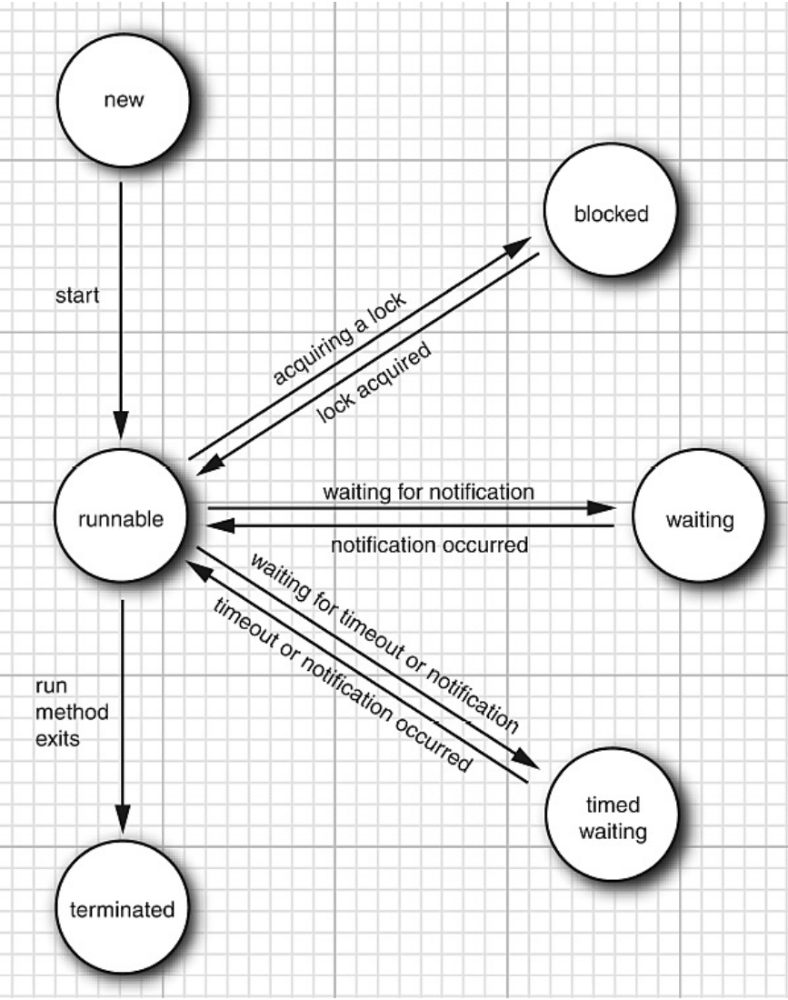

# Thread: Basics

## States/状态



- 最开始为 new 状态（你创建了 Thread 对象）
- 你 invoke 了 start() 方法，Thread 对象进入 runnable 状态
- 一些方法有一个 timeout 参数。调用 
它们会使线程进入 time waiting  状态。这个状态会持续到 timeout 过期或收到适当的通知。
- 当线程等待另一个线程，其进入等待状态
- 大部分线程尝试 acquire 一个被其他线程 hold 的锁，这个线程进入 blocked 状态
- 线程被 terminated 哟与两个原因
  - 正常退出
  - 非正常退出（触发未捕捉的异常）

## In Java

一个线程与其他线程共享应用程序范围内的资源，如内存和文件柄。


### Creating Threads/创建线程

2 ways to do:
- Extending Thread
- Implement `Runnable` interface

#### Extending

```java
class Example extends Thread {
    public void run() {
        // do something...
    }

    public static void main(String[] args) {
        Example ex1 = new Example();
        ex1.start();

        Example ex2 = new Example();
        ex2.start();
    }
}
```

#### Implement

```java
class Example implements Runnable {
    public void run() {
        // do something...
    }

        public static void main(String[] args) {
        Example ex1 = new Example();
        Thread t1 = new Thread(ex1);
        t1.start();

        Example ex2 = new Example();
        Thread t2 = new Thread(ex2);
        t1.start();
    }
}
```

### Thread Sleep

`Thread.sleep` 让当前线程睡眠指定的时间，然后继续执行。

其可以让处理器给予其他线程处理时间，

sleep 可以被 interrupts 打断。

```java
public class SleepExample extends Thread {
    public void run() {
        for (int i = 0; i < 3; i++) {
            try {
                Thread.sleep(1000);
            } catch (InterruptedException e) {
                System.out.println(e);
            }
            System.out.println(Thread.currentThread().getName() + i);
        }
    }

    public static void main(String args[]) {
        SleepExample ex1 = new SleepExample();
        ex1.start();
        SleepExample ex2 = new SleepExample();
        ex2.start();
    }
}
```

### Thread Interrupts

- 当返回方法被执行或者执行完这个方法的最后一条语句，或者是触发了未捕捉的异常，线程会被中止（terminated）
- 中断是对一个线程的指示，它应该停止它正在做的事情，并做其他事情。当中断方法在一个线程上被调用时，该线程的中断状态被设置。这是一个 boolean 标志，存在于每个线程中。
- 每个线程都应该偶尔检查一下它是否被中断了。为了使中断机制正常工作，被中断的线程必须支持自己的中断。

```java
try {
    while (!Thread.currentThread().isInterrupted() /* && more */) {
        // do something...
    }
}
// 当在一个线程上调用中断方法时，该线程阻塞了诸如等待之类的调用，阻塞调用将由 InterruptedException 终止。
catch (InterruptedException e) {
    // Thread was interrupted during sleep or wait
}
finally {
    // clean up
}
// Exit
```

```java
try {
    while (/* to do */) {
        // do something...
        // sleep 会产生 InterruptedException
        Thread.sleep(delay);
    }
}
catch (InterruptedException e) {
    // Thread was interrupted during sleep
}
finally {
    // clean up
}
// Exit
```

### Thread Join

`join` 允许一个线程去等待另一个线程完成。

```
Main Thread ---->---->----------->block###########continue-->
                  \                  |           |
Sub Thread start() \                 |           |
                    \                |           |
                     ---Sub Thread ---->----->finish
```

```java
public class JoinExample extends Thread {
    public void run() {
        //...
        Thread.sleep(4000);
        //...
    }
    public static void main(String args[]) throws InterruptedException {
        System.out.println("main thread start");
        JoinExample t1 = new JoinExample("t1");
        t1.start();

        System.out.println("main thread wait t1 finish");
        t1.join();

        System.out.println("main thread after t1.join()");
        JoinExample t2 = new JoinExample("t2");
        //...
    }
}
```

### Thread Priority

- 每个线程拥有一个优先级。线程优先级默认为 `Thread.NORM_PRIORITY`（常数 5）
- 可以使用 `setPriority(int)` 指定优先级，优先级为 1-10 的整数。
- 一些优先级常量
  - `Thread.MIN_PRIORITY`
  - `Thread.MAX_PRIORITY`
  - `Thread.NORM_PRIORITY`


### Executor Service

- 构建新线程是昂贵的，因为其需要和操作系统交换
- 如果你的程序构建大量短期（short-lived）线程，其应使用线程池替代。线程池包含一定数量的随时可以运行（ready to run）的空余（idle）线程。当这些线程的 run 方法退出时，线程不会死（die），而是会留下来服务下一个请求。
- 使用线程池的另一个原因是限制并发线程的数量。 创建大量线程会大大降低性能。

```java

public class ExecuterExample implements Runnable {
    public void run() {
        //. . .
        Thread.sleep(3000); // 3 seconds
        //. . .
    }
    public static void main(String[] args) {
        ExecuterExample task1 = new ExecuterExample("task1");
        ExecuterExample task2 = new ExecuterExample("task2");
        //. . .

        ExecutorService executorService = Executors.newCachedThreadPool();
        executorService.execute(task1); // start task1
        executorService.execute(task2); // start task2
        //. . .
        executorService.shutdown();
    }
}
```

## Reference

- https://docs.oracle.com/en/java/javase/15/docs/api/java.base/java/lang/Thread.html
- https://docs.oracle.com/javase/8/docs/api/java/util/concurrent/ExecutorService.html